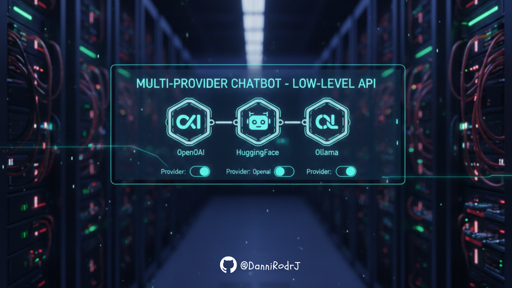

# ```Framework-Agnostic LLM Engine (Full Stack)```




A production-grade, full-stack AI Agent built from **first principles**. This project demonstrates how to architect a robust LLM engine without relying on heavy orchestration frameworks (like LangChain), focusing on observability, concurrency, and fine-grained control over the inference lifecycle.

## 📹 ```Video de Demo```

## 🏗️ ```Architecture & Design Decisions```

### 1. Why "No-Framework"? (Architecture Ownership)
Instead of adapting business logic to a framework's opinionated structure, I implemented custom patterns:
* **Provider Factory:** A standardized interface (`LLMProvider`) that allows adding any model (OpenAI, DeepSeek, Llama 3) with type safety.
* **Manual Tool Execution:** Native implementation of JSON Schema parsing to execute Python functions strictly and securely (File System, Web Search).

### 2. Solving the "Blocking" Problem (AsyncIO + ThreadPools)
Real-world AI apps often freeze while "thinking."
* **Solution:** The backend uses **FastAPI** with `ThreadPoolExecutor` to offload blocking inference calls (I/O bound APIs or CPU bound local models) to background threads, keeping the main Event Loop responsive.

### 3. Decoupled State (Dependency Injection)
"Memory" is treated as an infrastructure concern, not an agent property.
* **Implementation:** A `MemoryStore` interface is injected into the Agent at runtime. This architecture is **future-proof**, allowing a seamless transition from In-Memory storage (RAM) to persistent databases (Redis/SQL) without changing a single line of the Agent's core logic.

## 💻 ```Tech Stack```

| Component | Technology | Description |
| :--- | :--- | :--- |
| **Backend** | **FastAPI** | High-performance Async REST API. |
| **Frontend** | **React + Vite** | Reactive UI with TailwindCSS. |
| **Concurrency** | **ThreadPoolExecutor** | Non-blocking inference handling. |
| **Inference** | **OpenAI / Ollama / HF** | Hybrid Cloud & Local model support. |
| **Validation** | **Pydantic** | Strict data validation & settings management. |

## 🚀 ```Key Features```

* **⚡ Hot-Swap Providers:** Switch from OpenAI (Cloud) to Ollama (Local) mid-conversation without losing context history.
* **🛠️ Native Tool Calling:** The agent can interact with the local file system (read/edit code) and fetch real-time data from the web using raw JSON handling.
* **🔍 Internal Flow Panel:** A custom frontend component that visualizes the "Brain" of the agent:
    * Raw System Prompt injected.
    * Exact JSON payload sent to the API.
    * Tool execution outputs.

## ```Local Installation and Execution```

1. Clone the repository: 
```bash
  git clone https://github.com/DanniRodrJ/low-level-llm-chat
  cd low-level-llm-chat
```
2. Backend:
```bash
  cd backend
  python -m venv venv
  source venv/bin/activate  # Windows: venv\Scripts\activate
  pip install -r requirements.txt
  uvicorn app:app --reload --port 8000
```
3. Frontend:
```bash
  cd frontend
  npm install
  npm run dev
```
4. Open: http://localhost:5173
   
## ```Recommended Test Prompts```
These prompts demonstrate tool calling, chaining, and the internal flow panel (open the panel to view logs and memory):

- **Simple file system**: “List the files in the current directory”
- **Reading**: “Read the contents of README.md”
**Editing**: “Create a demo.txt file with ‘Hello from low-level chat’ and then read it”
- **Real weather**: “What is the temperature in Madrid?”
Web search: “Search the internet for ‘Python best practices 2026’”
- **Advanced chaining**: “List the files, search the internet for ‘what is tool calling in LLMs’ and create a tool_calling.txt file with a short summary of the first result”

## 💡 ```Key Engineering Takeaways```
This project demonstrates a shift towards infrastructure-aware AI development, focusing on:

1. Vendor Agnosticism: The architecture allows switching model providers purely through configuration/injection, preventing vendor lock-in.

2. System Observability: Full visibility into the reasoning chain (InternalFlowPanel) enables rapid debugging of hallucinations.

3. Scalable Patterns: Designing with concurrency and separation of concerns (Factory, Repository Pattern) ensures the system is ready for real-world traffic scenarios.

## 👩‍💻 ```Developer```

If you would like to contact me, simply click on my name and you will be redirected to my LinkedIn profile. I would be delighted 🤗 to answer your questions and share more details about my skills and experience.

<div align="center">

*AI Engineer*
| [<br><sub>Danniela Rodríguez</sub>](https://www.linkedin.com/in/danniela-rodriguez-jove-/)
| :---: |

<div align="left">

## 🙌 ```Acknowledgements and Updates```

*Thank you for reviewing this project* 🤗! *If you would like to stay informed about future updates, please star the repository* ⭐. *You can find the option to do so at the top right of the page. Your support is greatly appreciated.*


